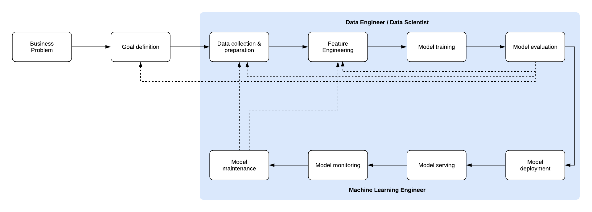

# NLP with BlazingText on AWS SageMaker

The aim of this project is to show an end to end deployment of an NLP model using the BlazingText algorithm from AWS SageMaker. This repository will build ontop of concepts already demonstrated in the [Learn SageMaker Book](https://www.amazon.co.uk/Learn-Amazon-SageMaker-developers-scientists/dp/1801817952) by Julien Simone.

## Sharp question

It is critical to frame the problem correctly whenever you begin a project, no matter how small or huge. As a result, I usually begin with the sharp question we're attempting to address (emphasis on sharp).

> Can we monitor the voice of the customer? / Can we track our customers' attitude towards our products?

### Objective

Build an end-to-end sentiment analysis model.

### Why

To increase customer satisfaction and get knowledge of how our customers speak out about their experience.

### Data

 [Amazon reviews data](https://s3.amazonaws.com/amazon-reviews-pds/readme.html)

## Blazing Text

BlazingText is a supervised NLP text classification algorithm developed by [Amazon](https://dl.acm.org/doi/10.1145/3146347.3146354). It is an extension of Facebook's [FastText](https://fasttext.cc). Blazing text has the ability to train on GPU instances whereas FastText only supports CPU. This advantage is speed makes a significant difference.

## Data Preparation

Every algorithm expects data in a certain format. BlazingText expects labeled input data.

- A text file with one sample per line.
- Each line has two fields as follows:
a) Label : __label__LABELNAME__
b) Text: formed into space-separated tokens (words and punctuation)

With such conditions the text will need to be heavily processed, converted and saved in the appropriate format.

### End to End ML Workflow

SageMaker has

Credit: [Learn SageMaker Book](https://www.amazon.co.uk/Learn-Amazon-SageMaker-developers-scientists/dp/1801817952)